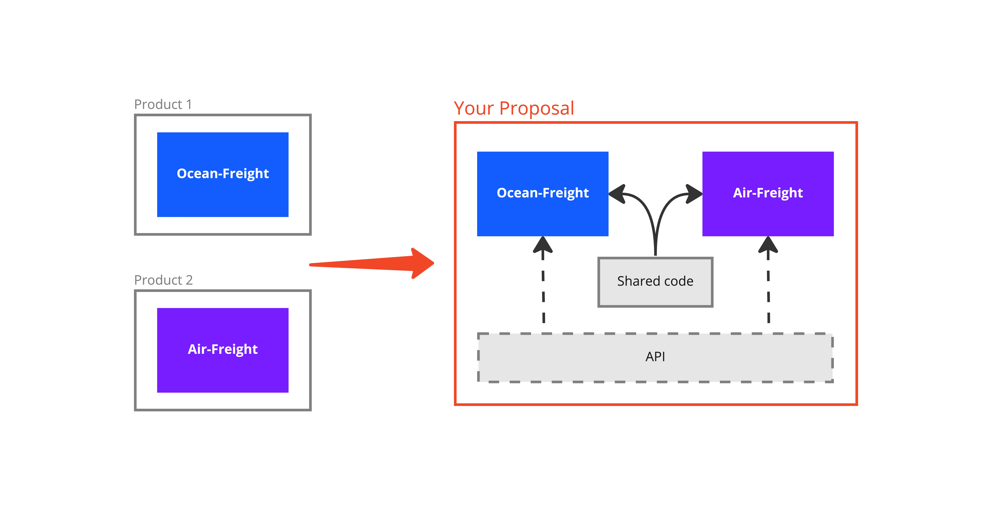
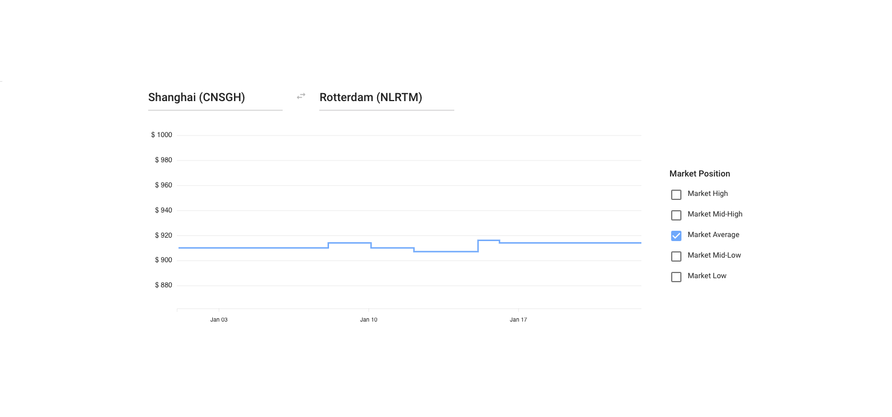

# Context

You are working in a team that is tasked with developing 2 products - **Ocean-Freight** and **Air-Freight**. 

Each application offers customers a simple interface that fetches data from an API for a specific `origin` + `destination` combination, and plots that data on a time series chart. The **Ocean-Freight** application displays ocean freight market data, whereas the **Air-Freight** displays air freight market data.

You have volunteered to prepare a small prototype for your team to showcase how these 2 products can be structured, developed and maintained as a frontend monorepo.

# Assignment

We ask you to implement a small frontend monorepo with shared libraries.



For each product, create an interactive prototype that visualizes how average, low and high prices change over time on a selected trade-lane. For plotting that data on a time series chart, you are free to choose any framework / library you prefer. Here is a suggestion on how you can implement the layout and components:



The user of the page should be able to do text search in origin and destination inputs, and when those are chosen the user should see a graph that displays average, low and high market prices over time.

# Extra details

To distinguish the applications visually, you can use these primary colors:
-  `#135DFF` - Ocean Freight
-  `#771DFF` - Air Freight

The solution should follow these guidelines:
- No duplicated code. Common functionality should be extracted into a shared library within the monorepo
- The architecture should be scalable to enable more applications being added in the future (if needed)
- The design of the applications should be consistent and follow a common design-system pattern

The solution should have the following processes supported:
- Serving individual applications locally
- Building individual applications into individual folders to be ready for deploy
- Linting individual applications and shared libraries

Some additional steps you might consider looking into (not a requirement):
- Adding tests for components, functions or any other functionality
- Using Docker to containerize the application

Keep your solution in a Version Control System of your choice. Provide the solution as a public repository that can be easily cloned by our development team.

Provide step-by-step instructions needed to set up and run the system locally in README.md.

If you have any questions, please don't hesitate to contact us

Our key evaluation criteria:
- Ease of setup for local development
- Code clarity and simplicity
- Comments where appropriate
- Code organization

# API Description

In order to have the prototypes interactive, we have prepared an API that serves a simplified subset of real-world data. This API is only for development / prototyping purposes and offers very limited functionality.

## Authorization

API is protected by an unique API key, which is sent to you along with this task specification. If you have not received your API key, do not hesitate to contact us.

To authorize with the API, send `X-Api-Key=<your-api-key>` header in the API request.

## Ports / Airports API

This API endpoint returns ports / airports that are available in the system. Information about each port includes:

- Port / Airport code
- Human-friendly name

Air-Freight example:
```
curl -H 'x-api-key: <your-api-key>' https://685rp9jkj1.execute-api.eu-west-1.amazonaws.com/prod/air/airports
```
```
[
    {
        "code": "JFK",
        "name": "New York"
    },
    ...
]
```

Ocean-Freight example:
```
curl -H 'x-api-key: <your-api-key>' https://685rp9jkj1.execute-api.eu-west-1.amazonaws.com/prod/ocean/ports
```
```
[
    {
        "code": "CNSGH",
        "name": "Shanghai"
    },
    ...
]

```

## Market rates API

This API endpoint returns market average, low and high prices of shipping a container on certain days between two locations that are sent to the API as parameters. Please note that not all the possible location pairs have corresponding market rate data.

API parameters are:

- `origin`, `destination`: Port / Airport codes, origin and destination locations respectively

Air-Freight example:
```
curl -H 'x-api-key: <your-api-key>' 'https://685rp9jkj1.execute-api.eu-west-1.amazonaws.com/prod/air/rates?origin=SHA&destination=JFK'
```
```
[
    {
        "day": "2021-01-01",
        "mean": 500,
        "low": 100,
        "high": 800
    },
    ...
]
```

Ocean-Freight example:
```
curl -H 'x-api-key: <your-api-key>' 'https://685rp9jkj1.execute-api.eu-west-1.amazonaws.com/prod/ocean/rates?origin=CNSGH&destination=NOOSL'
```
```
[
    {
        "day": "2021-01-01",
        "mean": 500,
        "low": 100,
        "high": 800
    },
    ...
]
```